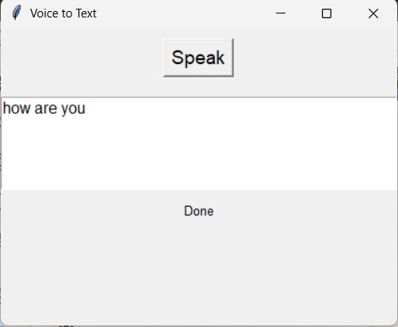

# Speech Recognition System
A simple Voice to Text application built using Python, Tkinter, and the SpeechRecognition library.
## Project Description

This project is a Speech Recognition System that converts spoken audio into text using Machine Learning and Deep Learning techniques. The system takes audio input from a microphone or audio file, processes it, extracts features, and predicts the corresponding text output.

The main goal of this project is to understand how speech signals are processed and how deep learning models can be used for speech-to-text conversion.

---

## Features

- Convert speech to text
- Supports microphone input
- Supports audio file input
- Audio preprocessing and feature extraction
- Deep learning-based prediction
- Easy to run and modify

---

## Technologies Used

- Python
- NumPy
- Pandas
- Librosa
- TensorFlow / Keras
- Scikit-learn
- Matplotlib

---

## Installation

### Step 1: Clone the repository

git clone https://github.com/your-username/speech-recognition.git

### Step 2: Navigate to the folder

cd speech-recognition

### Step 3: Install required packages

pip install -r requirements.txt

---

## How to Run

python app.py

---
## Output

